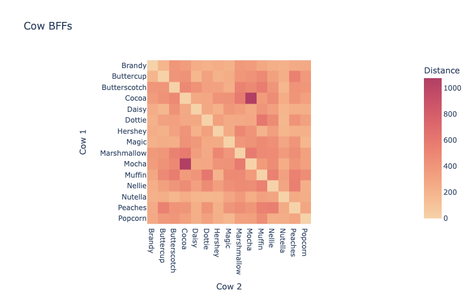

# Cow BBF Project

This is a sample data engineering project that tries to answer the question if cow best friends also take their meals together. 

This project has been used for the "[Path to Production: Databricks Project CICD FOR Seamless Inner to Outer Dev Loops](https://www.databricks.com/dataaisummit/session/path-production-databricks-project-cicd-seamless-inner-outer-dev-loops)" talk at DATA+AI Summit 2024 and the "[Bridging the Production Gap: Develop and Deploy Code Easily With IDEs](https://www.databricks.com/dataaisummit/session/bridging-production-gap-develop-and-deploy-code-easily-ides/)" talk at DATA+AI Summit 2023.

For the demo at DAIS 2024, use the `dais24-main` branch for the complete code and the `dais24-stageX` branches for snapshots. For the demo at DAIS 2023, see the `main` branch for the complete code and the `stageX` branches for snapshots 

The DAIS 2024 Video will be linked here after the event.

## Preparing the sample Data

The notebook `/notebooks/Generate Cow Data.ipynb` contains the code to generate the sample data. In order to create the sample data, clone this repo or import this notebook into your Databricks workspace and execute it there. Alternatively you can open the notebook in VS Code with the Databricks extension installed and execute the `Databricks: Run File as Workflow on Databricks` command.